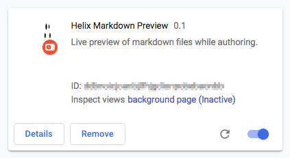

# Helix Markdown Preview
Google Chrome Extension to preview markdown files while editing.

## Installation

### Developer mode
1. Clone this repository
2. Open Chrome and go to chrome://extensions
3. Turn on _Developer mode_ at the top right of the header bar 

4. Click the _Load unpacked_ button in the action bar 

5. Navigate to the `src` directory in your local clone and click select to install and activate the extension
6. Verify if your _Extensions_ page displays a box like this: 
 
   and the tool bar shows a grayed out Helix icon: 

### End user mode
Stay tuned...

## Usage

### Preview as you type
1. Navigate to a markdown (*.md) file on `github.com`.
2. Switch to edit mode. Notice that the Helix icon is colored now: 

3. Click the Helix icon in the tool bar.
4. A popup opens, showing the rendered markdown.
5. Edit the markdown on `github.com` and observe the changes in the popup.

### Preview static file
1. Navigate to a markdown (*.md) file on `github.com`.
2. Click the _Raw_ button. Notice that the Helix icon is colored now: 

3. Click the Helix icon in the tool bar.
4. A popup opens, showing the rendered markdown.

## 3rd party dependencies

Helix Markdown Preview uses:
* [Marked](https://github.com/markedjs/marked) JS library to render markdown in the preview
* [Primer](https://primer.style/) CSS for GitHub-style output

Both are released under [MIT License](https://opensource.org/licenses/MIT).
