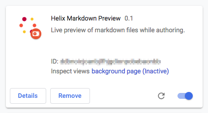

# Helix Markdown Preview
Google Chrome Extension to preview markdown files while editing.

## Installation

### Developer mode
1. Clone this repository to your local disk
2. Open Chrome and go to `chrome://extensions`
3. Turn on _Developer mode_ at the top right of the header bar 

4. Click the _Load unpacked_ button in the action bar 

5. Navigate to the `src` directory in your local clone and click select to install and activate the extension
6. Verify if your _Extensions_ page displays a box like this: 
 
   and the tool bar shows a grayed out Helix icon: 

### End user mode
Stay tuned...

## Usage

### Preview as you type (standalone mode only for now)
1. Navigate to a markdown (*.md) file on `github.com`.
2. Switch to edit mode. Notice that the Helix icon is colored now: 

3. Click the Helix icon in the tool bar.
4. A popup opens, showing the rendered output.
5. Edit the markdown and observe the changes in the popup.

### Preview static file
1. Navigate to a markdown (*.md) file on `github.com`.
2. Click the _Raw_ button. Notice that the Helix icon is colored now: 

3. Click the Helix icon in the tool bar.
4. A popup opens, showing the rendered output.

## Helix Configuration
By default, the markdown will be previewed in standalone, client-sided mode. In order to let a local Helix server render the markdown, follow these steps:

1. Start a local Helix server (see [www.project-helix.io](https://www.project-helix.io) how to set it up).
2. Open the project on `github.com` and start editing a markdown (*.md) file.
3. Right-click the Helix icon in the toolbar and select 'Options'.
4. Click the checkbox to use Helix rendering.
5. Provide the base URL of your Helix instance (e.g. `http://localhost:3000`).
6. Click the Helix icon in the tool bar.
7. A popup opens, showing the rendered output from Helix.
8. Edit the markdown and observe the changes in the popup.

## 3rd party dependencies

Helix Markdown Preview uses the following libraries:
* [Marked](https://github.com/markedjs/marked) JS library to render markdown in the preview ([MIT License](https://opensource.org/licenses/MIT))
* [diffDOM](https://github.com/fiduswriter/diffDOM) JS library to diff DOM elements ([LGPL v3](https://www.gnu.org/licenses/lgpl-3.0.txt))
* [Primer](https://primer.style/) CSS for GitHub-style output ([MIT License](https://opensource.org/licenses/MIT))
